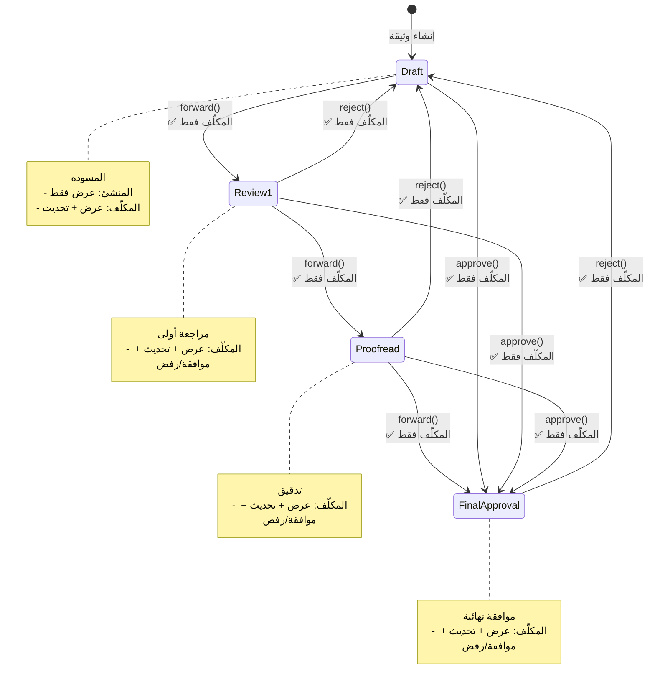
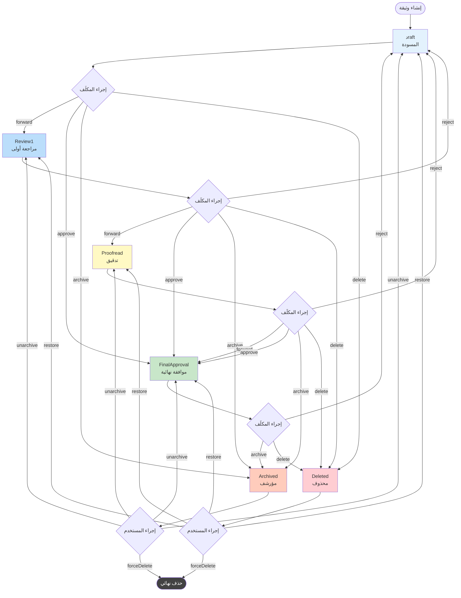
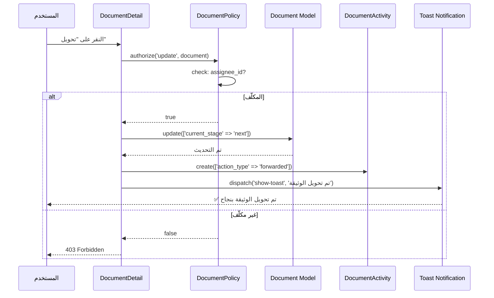
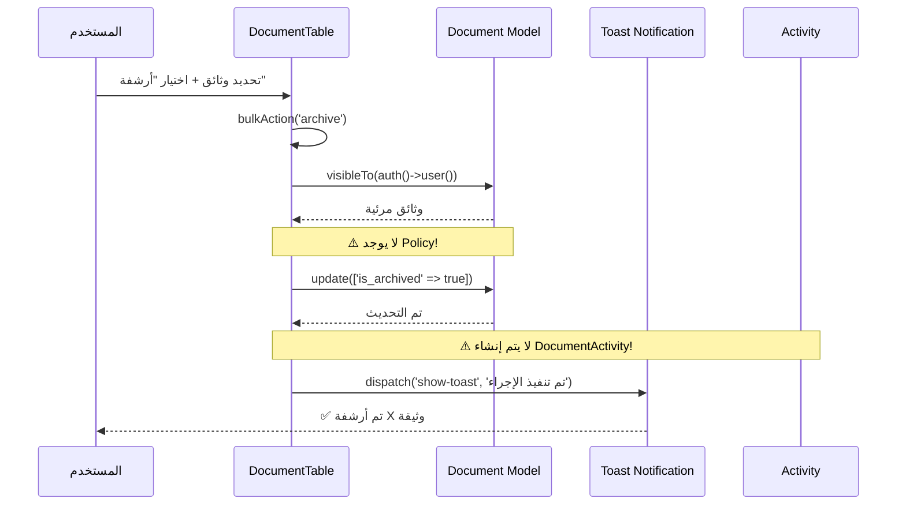
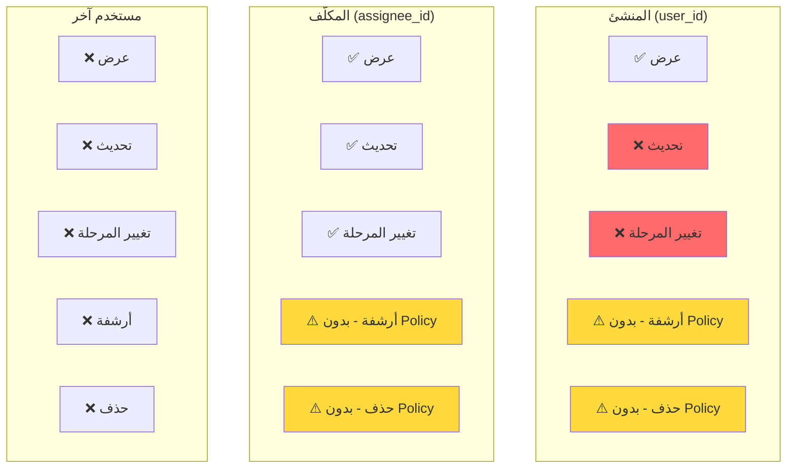
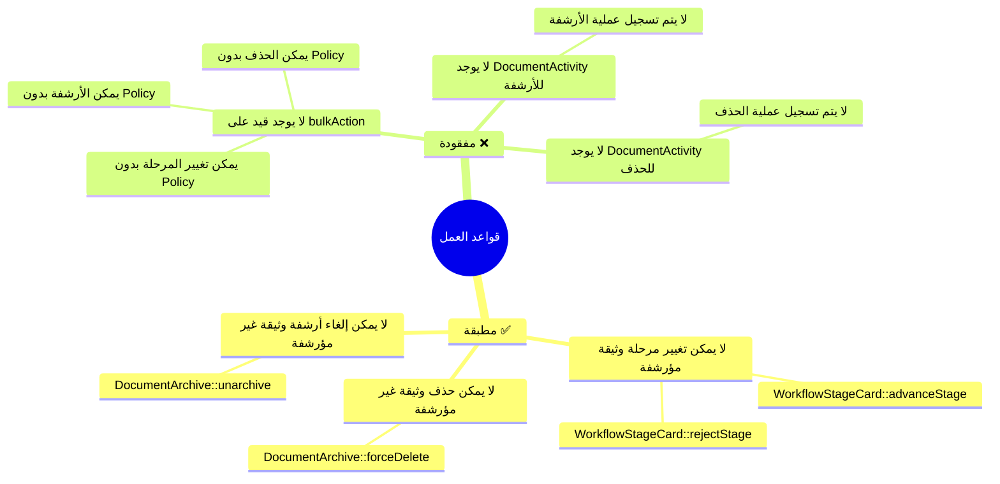

---
**Updated:** 2025-12-22 - Defao v1.0.1  
**Status:** ✅ Production Ready  
**Features:** Workflow, Reports link, Arabic toasts  
---

# مخططات دورة حياة الوثيقة - Mermaid Diagrams

## 1. State Diagram - دورة حياة الوثيقة الكاملة

```mermaid
stateDiagram-v2
    [*] --> Draft: DocumentUpload::save<br/>current_stage = 'draft'<br/>is_archived = false
    
    Draft --> Review1: forward() / advanceStage()<br/>✅ المكلّف فقط
    Review1 --> Proofread: forward() / advanceStage()<br/>✅ المكلّف فقط
    Proofread --> FinalApproval: forward() / advanceStage()<br/>✅ المكلّف فقط
    
    Draft --> FinalApproval: approve()<br/>✅ المكلّف فقط
    Review1 --> FinalApproval: approve()<br/>✅ المكلّف فقط
    Proofread --> FinalApproval: approve()<br/>✅ المكلّف فقط
    
    Review1 --> Draft: reject() / rejectStage()<br/>✅ المكلّف فقط
    Proofread --> Draft: reject() / rejectStage()<br/>✅ المكلّف فقط
    FinalApproval --> Draft: reject() / rejectStage()<br/>✅ المكلّف فقط
    
    Draft --> Archived: archiveDocument() / bulkAction('archive')<br/>⚠️ visibleTo فقط
    Review1 --> Archived: archiveDocument() / bulkAction('archive')<br/>⚠️ visibleTo فقط
    Proofread --> Archived: archiveDocument() / bulkAction('archive')<br/>⚠️ visibleTo فقط
    FinalApproval --> Archived: archiveDocument() / bulkAction('archive')<br/>⚠️ visibleTo فقط
    
    Archived --> Draft: unarchive()<br/>⚠️ visibleTo فقط
    Archived --> Review1: unarchive()<br/>⚠️ visibleTo فقط
    Archived --> Proofread: unarchive()<br/>⚠️ visibleTo فقط
    Archived --> FinalApproval: unarchive()<br/>⚠️ visibleTo فقط
    
    Draft --> Deleted: bulkAction('delete')<br/>⚠️ visibleTo فقط
    Review1 --> Deleted: bulkAction('delete')<br/>⚠️ visibleTo فقط
    Proofread --> Deleted: bulkAction('delete')<br/>⚠️ visibleTo فقط
    FinalApproval --> Deleted: bulkAction('delete')<br/>⚠️ visibleTo فقط
    Archived --> Deleted: bulkAction('delete')<br/>⚠️ visibleTo فقط
    
    Deleted --> Draft: restoreDocument()<br/>⚠️ visibleTo فقط
    Deleted --> Review1: restoreDocument()<br/>⚠️ visibleTo فقط
    Deleted --> Proofread: restoreDocument()<br/>⚠️ visibleTo فقط
    Deleted --> FinalApproval: restoreDocument()<br/>⚠️ visibleTo فقط
    
    Archived --> [*]: forceDelete()<br/>⚠️ visibleTo فقط<br/>حذف نهائي
    Deleted --> [*]: forceDeleteDocument()<br/>⚠️ visibleTo فقط<br/>حذف نهائي
    
    note right of Draft
        المسودة
        ✅ DocumentPolicy@update
        ⚠️ bulkAction بدون Policy
    end note
    
    note right of Review1
        مراجعة أولى
        ✅ DocumentPolicy@update
        ⚠️ bulkAction بدون Policy
    end note
    
    note right of Proofread
        تدقيق
        ✅ DocumentPolicy@update
        ⚠️ bulkAction بدون Policy
    end note
    
    note right of FinalApproval
        موافقة نهائية
        ✅ DocumentPolicy@update
        ⚠️ bulkAction بدون Policy
    end note
    
    note right of Archived
        أرشيف
        ⚠️ لا يوجد Policy
        أي مستخدم يرى الوثيقة
    end note
    
    note right of Deleted
        محذوفة (soft delete)
        ⚠️ لا يوجد Policy
        أي مستخدم يرى الوثيقة
    end note
```

## 2. State Diagram - مراحل سير العمل فقط



## 3. Flowchart - مسار الوثيقة النموذجي



## 4. Sequence Diagram - عملية تغيير المرحلة



## 5. Sequence Diagram - عملية الأرشفة



## 6. Permission Matrix - من يستطيع ماذا؟



## 7. Business Rules Diagram



## 8. Events Timeline - خط زمني للأحداث

```mermaid
gantt
    title خط زمني لأحداث الوثيقة
    dateFormat YYYY-MM-DD
    section إنشاء
    DocumentActivity::create('created') :done, create1, 2025-01-27, 1d
    DocumentActivity::create('uploaded') :done, create2, 2025-01-27, 1d
    section سير العمل
    DocumentActivity::create('forwarded') :active, forward, 2025-01-28, 1d
    DocumentActivity::create('approved') :approved, 2025-01-29, 1d
    DocumentActivity::create('rejected') :crit, reject, 2025-01-30, 1d
    section الأرشفة
    archiveDocument() :milestone, archive, 2025-02-01, 0d
    section الحذف
    bulkAction('delete') :crit, delete, 2025-02-02, 1d
    forceDelete() :crit, force, 2025-02-03, 1d
```

---

**ملاحظة:** جميع المخططات مبنية على تحليل الكود الفعلي في المشروع.

