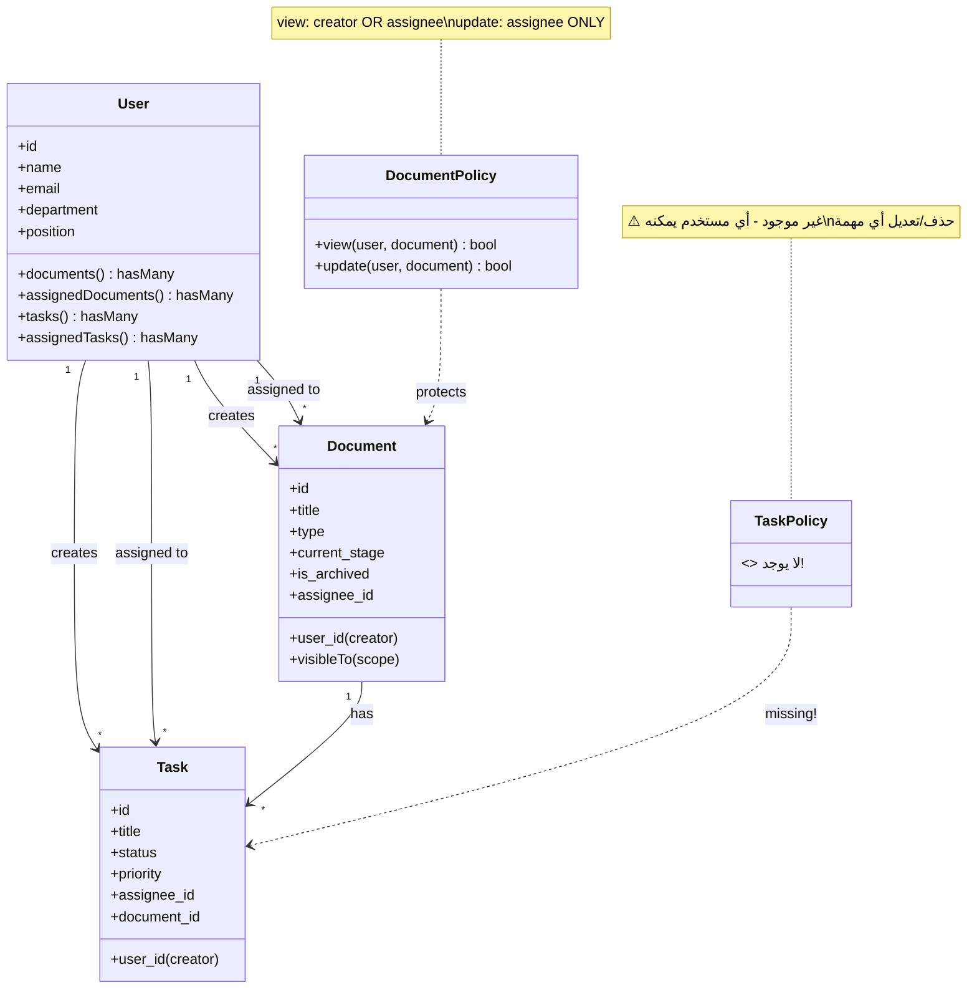
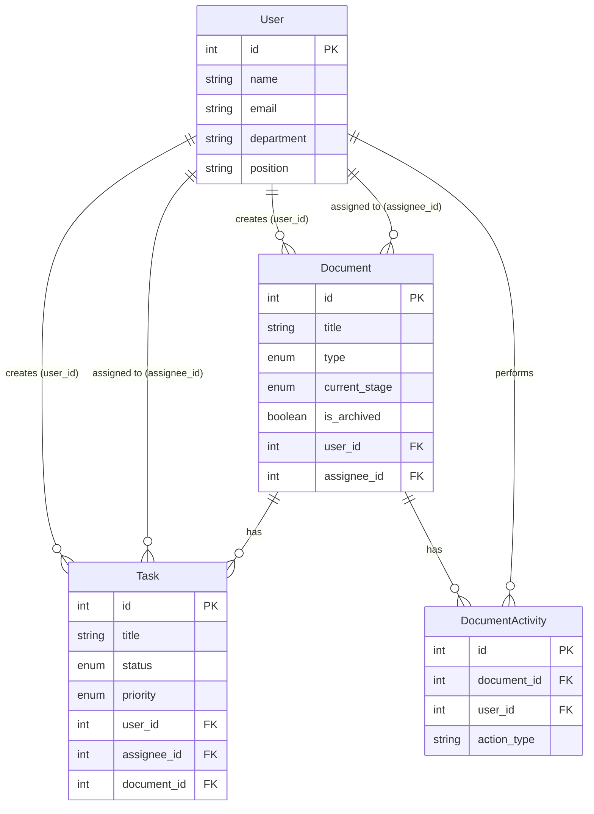

---
**Updated:** 2025-12-22 - Defao v1.0.1  
**Status:** ✅ Production Ready  
**Features:** Workflow, Reports link, Arabic toasts  
---

# الخريطة التنظيمية الشاملة - نظام إدارة الوثائق

## 📊 ملخص تنفيذي

هذا المستند يوضح **الأدوار والصلاحيات الحالية** في النظام بناءً على تحليل الكود الفعلي (Laravel + Livewire).

---

## 🔍 1. الأدوار الموجودة حالياً

### ⚠️ ملاحظة مهمة:
**لا يوجد تعريف صريح للأدوار في النظام الحالي!**

- ✅ النظام يستخدم **Spatie Laravel Permission** package (موجود في migrations)
- ❌ **User model لا يستخدم `HasRoles` trait**
- ❌ **لا يوجد استخدام للأدوار في الكود** (لا يوجد `hasRole()`, `assignRole()`)
- ✅ الصلاحيات تعتمد على **العلاقات** (`user_id`, `assignee_id`) وليس على الأدوار

### الأدوار المستنتجة من الكود:

بناءً على تحليل الكود، يمكن استنتاج الأدوار التالية **ضمنياً**:

1. **منشئ الوثيقة (Document Creator)** - `user_id`
2. **مكلّف الوثيقة (Document Assignee)** - `assignee_id`
3. **منشئ المهمة (Task Creator)** - `user_id` في Task
4. **مكلّف المهمة (Task Assignee)** - `assignee_id` في Task

---

## 🔐 2. الصلاحيات التفصيلية

### 2.1 صلاحيات الوثائق (Documents)

#### 📄 DocumentPolicy (الصلاحيات المحددة في الكود)

| الإجراء | الشرط | الملف المرجعي |
|---------|-------|---------------|
| **view** | ✅ المنشئ (`user_id`) **أو** المكلّف (`assignee_id`) | `DocumentPolicy@view` |
| **update** | ✅ المكلّف فقط (`assignee_id`) | `DocumentPolicy@update` |

#### 📋 الإجراءات الأخرى (بدون Policy صريح)

| الإجراء | الشرط الحالي | الملف المرجعي | ⚠️ المشكلة |
|---------|--------------|---------------|-----------|
| **create** | ✅ أي مستخدم مسجل (`auth()->id()`) | `DocumentUpload@save` | ❌ لا يوجد فحص صلاحيات |
| **delete** | ✅ أي مستخدم يرى الوثيقة (`visibleTo`) | `DocumentTable@bulkAction` | ❌ لا يوجد Policy |
| **archive** | ✅ أي مستخدم يرى الوثيقة (`visibleTo`) | `DocumentTable@archiveDocument` | ❌ لا يوجد Policy |
| **unarchive** | ✅ أي مستخدم يرى الوثيقة (`visibleTo`) | `DocumentArchive@unarchive` | ❌ لا يوجد Policy |
| **forceDelete** | ✅ أي مستخدم يرى الوثيقة (`visibleTo`) | `ArchiveTable@forceDeleteDocument` | ❌ لا يوجد Policy |
| **restore** | ✅ أي مستخدم يرى الوثيقة (`visibleTo`) | `ArchiveTable@restoreDocument` | ❌ لا يوجد Policy |

#### 🔄 سير العمل (Workflow Stages)

| الإجراء | الشرط | الملف المرجعي |
|---------|-------|---------------|
| **approve** | ✅ المكلّف فقط (`assignee_id`) | `DocumentDetail@approve` → `DocumentPolicy@update` |
| **reject** | ✅ المكلّف فقط (`assignee_id`) | `DocumentDetail@reject` → `DocumentPolicy@update` |
| **forward** | ✅ المكلّف فقط (`assignee_id`) | `DocumentDetail@forward` → `DocumentPolicy@update` |
| **change stage (bulk)** | ⚠️ أي مستخدم يرى الوثيقة (`visibleTo`) | `DocumentTable@bulkAction` | ❌ لا يوجد Policy |

**مراحل سير العمل:**
- `draft` → `review1` → `proofread` → `finalapproval`

---

### 2.2 صلاحيات المهام (Tasks)

#### ⚠️ لا يوجد TaskPolicy!

| الإجراء | الشرط الحالي | الملف المرجعي | ⚠️ المشكلة |
|---------|--------------|---------------|-----------|
| **create** | ✅ أي مستخدم مسجل (`auth()->id()`) | `TaskForm@save` | ❌ لا يوجد Policy |
| **update** | ✅ أي مستخدم (لا يوجد فحص) | `TaskForm@save` | ❌ لا يوجد Policy |
| **delete** | ✅ أي مستخدم (لا يوجد فحص) | `TaskList@deleteTask` | ❌ لا يوجد Policy |
| **assign** | ✅ أي مستخدم يمكنه إسناد المهام لأي مستخدم | `TaskForm@save` | ❌ لا يوجد Policy |
| **view** | ⚠️ غير محدد (لا يوجد scope) | - | ❌ لا يوجد Policy |

---

### 2.3 صلاحيات الأرشفة والحذف

#### 📦 الأرشفة (Archive)

| الإجراء | الشرط | الملف المرجعي |
|---------|-------|---------------|
| **archive** | ⚠️ أي مستخدم يرى الوثيقة | `DocumentTable@archiveDocument` |
| **unarchive** | ⚠️ أي مستخدم يرى الوثيقة | `DocumentArchive@unarchive` |
| **view archived** | ✅ المنشئ أو المكلّف (`visibleTo`) | `DocumentArchive@archivedDocuments` |

#### 🗑️ الحذف (Delete)

| الإجراء | الشرط | الملف المرجعي |
|---------|-------|---------------|
| **soft delete** | ⚠️ أي مستخدم يرى الوثيقة | `DocumentTable@bulkAction` |
| **restore** | ⚠️ أي مستخدم يرى الوثيقة | `ArchiveTable@restoreDocument` |
| **force delete** | ⚠️ أي مستخدم يرى الوثيقة | `ArchiveTable@forceDeleteDocument` |

---

## 🔗 3. علاقات الأدوار

### 3.1 من يستطيع إسناد المهام لمن؟

**الحالة الحالية:**
- ✅ **أي مستخدم** يمكنه إنشاء مهمة وإسنادها **لأي مستخدم آخر**
- ❌ **لا يوجد قيود** على من يستطيع إسناد المهام
- ❌ **لا يوجد Policy** للتحقق من صلاحية الإسناد

**الكود المرجعي:**
```php
// TaskForm.php - Line 110-119
Task::create([
    'user_id' => auth()->id(),        // المنشئ
    'assignee_id' => $this->assigned_to, // أي مستخدم
    // ...
]);
```

### 3.2 من يستطيع إسناد الوثائق لمن؟

**الحالة الحالية:**
- ✅ عند الإنشاء: الوثيقة تُسند تلقائياً للمنشئ (`assignee_id = auth()->id()`)
- ⚠️ **لا يوجد واجهة** لتغيير `assignee_id` بعد الإنشاء (في الكود المفحوص)
- ❌ **لا يوجد Policy** للتحقق من صلاحية تغيير المكلّف

---

## ⚠️ 4. نقاط الضعف والغموض

### 4.1 نقاط الضعف الحرجة 🔴

#### 1. **عدم وجود TaskPolicy**
- ❌ أي مستخدم يمكنه حذف/تعديل أي مهمة
- ❌ لا يوجد فحص صلاحيات على المهام
- **التأثير:** ثغرة أمنية كبيرة

#### 2. **عدم وجود Policy لعمليات الحذف والأرشفة**
- ❌ أي مستخدم يرى وثيقة يمكنه حذفها نهائياً
- ❌ أي مستخدم يرى وثيقة يمكنه أرشفتها
- **التأثير:** فقدان بيانات محتمل

#### 3. **عدم استخدام Spatie Permission**
- ✅ Package مثبت ومهيأ
- ❌ لا يتم استخدامه في الكود
- ❌ User model لا يستخدم `HasRoles` trait
- **التأثير:** إهدار للموارد، عدم استغلال نظام الصلاحيات

#### 4. **عدم وجود قيود على إسناد المهام**
- ❌ أي مستخدم يمكنه إسناد مهام لأي مستخدم
- ❌ لا يوجد تسلسل هرمي للأدوار
- **التأثير:** إدارة غير منظمة

### 4.2 نقاط الغموض ⚠️

#### 1. **من يستطيع تغيير assignee_id للوثيقة؟**
- ❓ غير واضح من الكود
- ❓ لا توجد واجهة لتغيير المكلّف

#### 2. **هل المنشئ يستطيع تحديث الوثيقة؟**
- ❌ حالياً: فقط المكلّف (`assignee_id`) يستطيع التحديث
- ❓ هل هذا مقصود؟ أم يجب أن يكون المنشئ قادراً على التحديث؟

#### 3. **من يستطيع رؤية جميع الوثائق؟**
- ✅ حالياً: فقط المنشئ والمكلّف (`visibleTo` scope)
- ❓ هل يجب أن يكون هناك دور "مدير" يرى كل شيء؟

#### 4. **من يستطيع تغيير مرحلة سير العمل؟**
- ✅ حالياً: المكلّف فقط (عبر `update` policy)
- ⚠️ لكن `bulkAction` يسمح لأي مستخدم بتغيير المرحلة!
- ❓ تناقض في الكود!

---

## 📊 5. المخططات

### 5.1 Mermaid Class Diagram - الأدوار والصلاحيات



### 5.2 Mermaid Flowchart - سير العمل والصلاحيات

```mermaid
flowchart TD
    Start([مستخدم مسجل]) --> CreateDoc{إنشاء وثيقة}
    CreateDoc -->|auth()->id()| DocCreated[وثيقة منشأة<br/>assignee_id = creator]
    
    DocCreated --> ViewDoc{عرض وثيقة}
    ViewDoc -->|DocumentPolicy@view| CanView{منشئ أو مكلّف?}
    CanView -->|نعم| ShowDoc[عرض الوثيقة]
    CanView -->|لا| DenyView[❌ رفض الوصول]
    
    ShowDoc --> UpdateDoc{تحديث وثيقة}
    UpdateDoc -->|DocumentPolicy@update| IsAssignee{مكلّف?}
    IsAssignee -->|نعم| AllowUpdate[✅ السماح بالتحديث]
    IsAssignee -->|لا| DenyUpdate[❌ رفض التحديث]
    
    AllowUpdate --> Workflow{سير العمل}
    Workflow -->|approve/reject/forward| ChangeStage[تغيير المرحلة]
    
    ShowDoc --> ArchiveDoc{أرشفة}
    ArchiveDoc -->|visibleTo فقط| ArchiveOK[✅ أرشفة بدون Policy]
    
    ShowDoc --> DeleteDoc{حذف}
    DeleteDoc -->|visibleTo فقط| DeleteOK[✅ حذف بدون Policy]
    
    Start --> CreateTask{إنشاء مهمة}
    CreateTask -->|auth()->id()| TaskCreated[مهمة منشأة<br/>assignee_id = أي مستخدم]
    
    TaskCreated --> UpdateTask{تحديث/حذف مهمة}
    UpdateTask -->|لا يوجد Policy| AllowAny[✅ أي مستخدم يمكنه<br/>تعديل/حذف أي مهمة]
    
    style DenyView fill:#ff6b6b
    style DenyUpdate fill:#ff6b6b
    style ArchiveOK fill:#ffd93d
    style DeleteOK fill:#ffd93d
    style AllowAny fill:#ff6b6b
```

### 5.3 Mermaid ER Diagram - العلاقات



---

## 📋 6. جدول الصلاحيات الشامل

### 6.1 صلاحيات الوثائق (Documents)

| الدور | إنشاء | عرض | تحديث | حذف | أرشفة | استعادة | حذف نهائي | تغيير المرحلة | الموافقة/الرفض |
|------|------|-----|-------|-----|-------|---------|-----------|--------------|----------------|
| **منشئ الوثيقة** (`user_id`) | ✅ | ✅ | ❌ | ⚠️ | ⚠️ | ⚠️ | ⚠️ | ❌ | ❌ |
| **مكلّف الوثيقة** (`assignee_id`) | ❌ | ✅ | ✅ | ⚠️ | ⚠️ | ⚠️ | ⚠️ | ✅ | ✅ |
| **مستخدم آخر** | ✅ | ❌ | ❌ | ❌ | ❌ | ❌ | ❌ | ❌ | ❌ |

**المفاتيح:**
- ✅ = مسموح (يوجد Policy أو فحص)
- ❌ = غير مسموح (يوجد Policy يمنع)
- ⚠️ = **غير آمن** (لا يوجد Policy، لكن الكود يسمح)

### 6.2 صلاحيات المهام (Tasks)

| الدور | إنشاء | عرض | تحديث | حذف | إسناد لأي مستخدم |
|------|------|-----|-------|-----|-----------------|
| **منشئ المهمة** (`user_id`) | ✅ | ⚠️ | ⚠️ | ⚠️ | ✅ |
| **مكلّف المهمة** (`assignee_id`) | ✅ | ⚠️ | ⚠️ | ⚠️ | ✅ |
| **مستخدم آخر** | ✅ | ⚠️ | ⚠️ | ⚠️ | ✅ |

**⚠️ تحذير:** جميع الصلاحيات غير محمية بـ Policy!

### 6.3 صلاحيات سير العمل (Workflow)

| الدور | نقل draft → review1 | نقل review1 → proofread | نقل proofread → finalapproval | الموافقة النهائية | الرفض |
|------|---------------------|------------------------|------------------------------|------------------|------|
| **منشئ الوثيقة** | ❌ | ❌ | ❌ | ❌ | ❌ |
| **مكلّف الوثيقة** | ✅ | ✅ | ✅ | ✅ | ✅ |
| **مستخدم آخر** | ❌ | ❌ | ❌ | ❌ | ❌ |

**⚠️ استثناء:** `bulkAction` في `DocumentTable` يسمح لأي مستخدم بتغيير المرحلة!

---

## 🎯 7. التوصيات

### 7.1 أولويات عاجلة 🔴

1. **إنشاء TaskPolicy**
   - `view`: المنشئ أو المكلّف
   - `update`: المكلّف فقط
   - `delete`: المنشئ فقط

2. **إضافة Policy للحذف والأرشفة**
   - `delete`: المنشئ فقط
   - `archive`: المنشئ أو المكلّف
   - `forceDelete`: المنشئ فقط

3. **إصلاح تناقض bulkAction**
   - منع تغيير المرحلة عبر `bulkAction` إلا للمكلّف

### 7.2 تحسينات مقترحة 🟡

1. **استخدام Spatie Permission**
   - إضافة `HasRoles` trait لـ User
   - تعريف أدوار: `admin`, `manager`, `user`
   - ربط الصلاحيات بالأدوار

2. **إضافة قيود على إسناد المهام**
   - فقط المدير أو المشرف يمكنه إسناد مهام
   - أو: المستخدم يمكنه إسناد مهام فقط لأعضاء فريقه

3. **إضافة صلاحية للمنشئ**
   - السماح للمنشئ بتحديث الوثيقة في مرحلة `draft`

---

## 📝 8. الخلاصة

### الوضع الحالي:
- ✅ **صلاحيات محدودة** على الوثائق (view, update)
- ❌ **لا توجد صلاحيات** على المهام
- ❌ **لا توجد صلاحيات** على الحذف والأرشفة
- ⚠️ **تناقضات** في الكود (bulkAction vs Policy)

### الأدوار الفعلية:
- **منشئ الوثيقة**: يمكنه الإنشاء والعرض فقط
- **مكلّف الوثيقة**: يمكنه العرض والتحديث وإدارة سير العمل
- **أي مستخدم**: يمكنه إنشاء/حذف/تعديل أي مهمة (⚠️ مشكلة أمنية)

### الخطوات التالية:
1. إنشاء Policies للمهام والحذف والأرشفة
2. إصلاح تناقضات الكود
3. اعتماد نظام Spatie Permission بشكل كامل

---

**تاريخ الإنشاء:** 2025-01-27  
**آخر تحديث:** 2025-01-27  
**الإصدار:** 1.0

