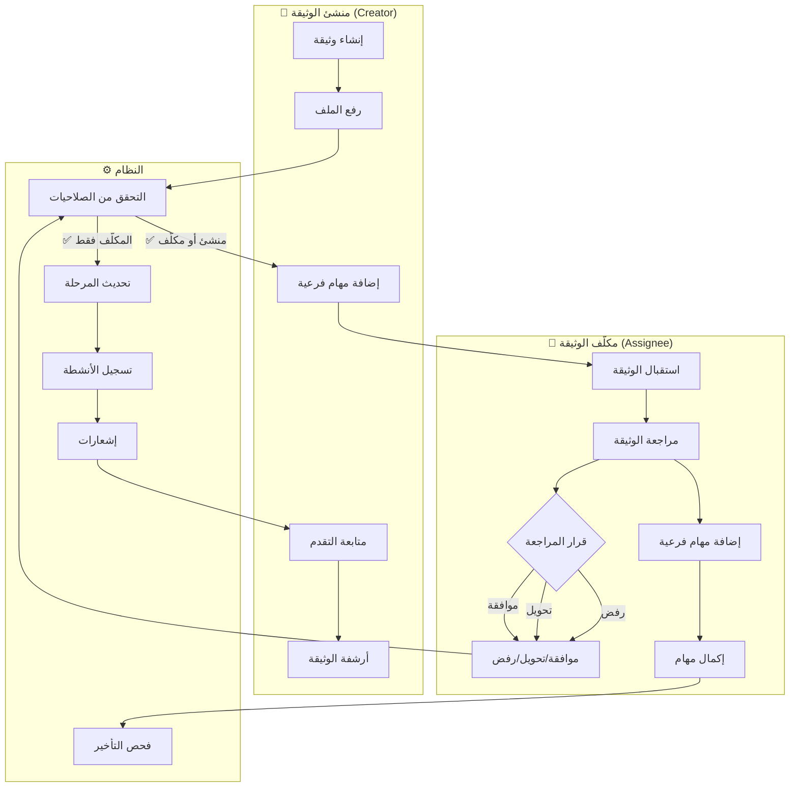
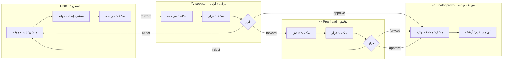
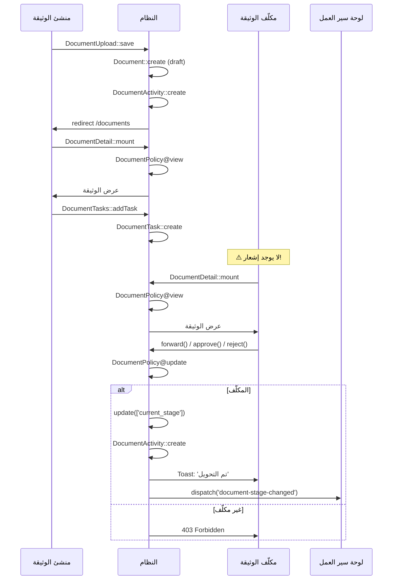
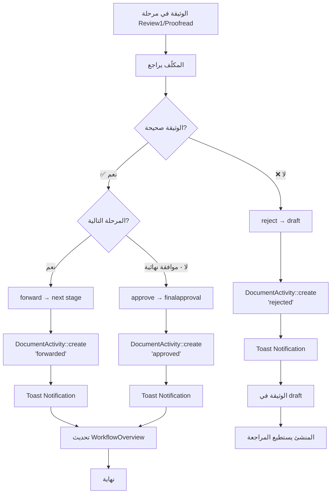
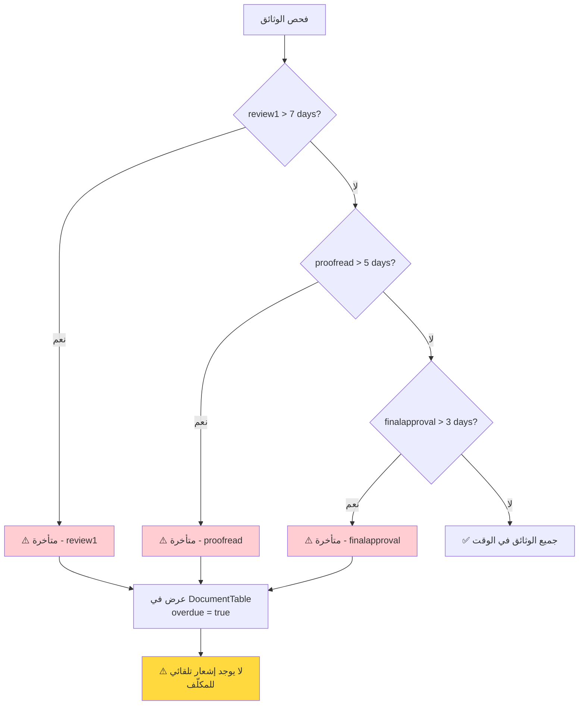

---
**Updated:** 2025-12-22 - Defao v1.0.3  
**Status:** ✅ Production Ready  
**Features:** Workflow, Reports link, Arabic toasts  
---

# مخططات Swimlane Diagram - Mermaid Diagrams

## 1. Swimlane Diagram - السيناريو الكامل



## 2. Swimlane Diagram - مراحل سير العمل



## 3. Sequence Diagram - تفاعل الأدوار



## 4. Decision Tree - قرارات المراجعة



## 5. Overdue Detection Flow



## 6. Bulk Actions Flow

```mermaid
flowchart TD
    Start[المستخدم يحدد وثائق] --> Select[تحديد وثائق<br/>checkbox]
    Select --> Action{اختيار إجراء}
    
    Action -->|أرشفة| Archive[bulkAction('archive')]
    Action -->|حذف| Delete[bulkAction('delete')]
    Action -->|تغيير مرحلة| Stage[bulkAction('stage_*')]
    
    Archive --> Check1{visibleTo?}
    Delete --> Check2{visibleTo?}
    Stage --> Check3{visibleTo?}
    
    Check1 -->|نعم| Update1[update is_archived = true]
    Check1 -->|لا| Skip1[تخطي]
    
    Check2 -->|نعم| Update2[soft delete]
    Check2 -->|لا| Skip2[تخطي]
    
    Check3 -->|نعم| Update3[update current_stage]
    Check3 -->|لا| Skip3[تخطي]
    
    Update1 --> Toast1[Toast: 'تم أرشفة X وثيقة']
    Update2 --> Toast2[Toast: 'تم حذف X وثيقة']
    Update3 --> Toast3[Toast: 'تم تغيير مرحلة X وثيقة']
    
    style Check1 fill:#ffd93d
    style Check2 fill:#ffd93d
    style Check3 fill:#ffd93d
    style Update3 fill:#ff6b6b
```

## 7. Archive Workflow

```mermaid
flowchart TD
    Start[وثيقة في أي مرحلة] --> Decision{المستخدم يريد أرشفة?}
    
    Decision -->|نعم| Archive[archiveDocument()<br/>أو bulkAction('archive')]
    Decision -->|لا| Continue[متابعة سير العمل]
    
    Archive --> Check{visibleTo?}
    Check -->|نعم| Update[update is_archived = true]
    Check -->|لا| Deny[❌ رفض]
    
    Update --> Archived[الوثيقة مؤرشفة]
    Archived --> View[عرض في DocumentArchive]
    
    View --> Unarchive{إلغاء أرشفة?}
    Unarchive -->|نعم| UnarchiveAction[unarchive()]
    Unarchive -->|لا| ForceDelete{حذف نهائي?}
    
    UnarchiveAction --> Check2{is_archived?}
    Check2 -->|نعم| Update2[update is_archived = false]
    Check2 -->|لا| Error[⚠️ خطأ: غير مؤرشفة]
    
    ForceDelete -->|نعم| ForceDeleteAction[forceDelete()]
    ForceDeleteAction --> Check3{is_archived?}
    Check3 -->|نعم| Delete[حذف نهائي من DB]
    Check3 -->|لا| Error2[⚠️ خطأ: لا يمكن حذف غير مؤرشفة]
    
    Update2 --> Active[الوثيقة نشطة مرة أخرى]
    Delete --> End[نهاية]
    
    style Check fill:#ffd93d
    style Check2 fill:#ffd93d
    style Check3 fill:#ffd93d
    style Update fill:#ffcdd2
    style UnarchiveAction fill:#ffcdd2
    style ForceDeleteAction fill:#ffcdd2
```

---

**ملاحظة:** جميع المخططات مبنية على تحليل الكود الفعلي في المشروع.

