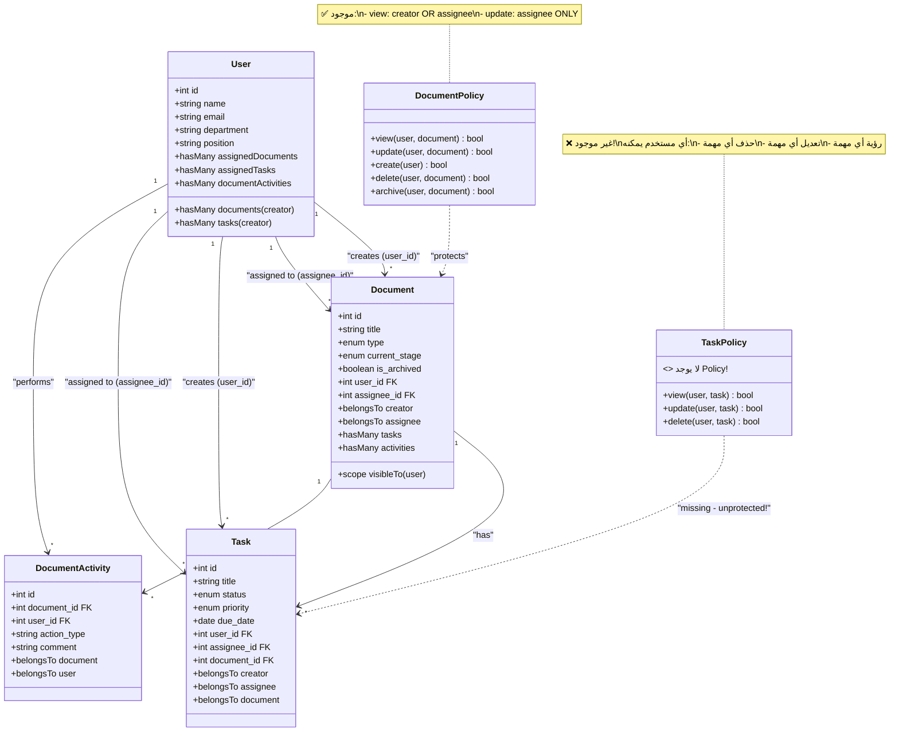
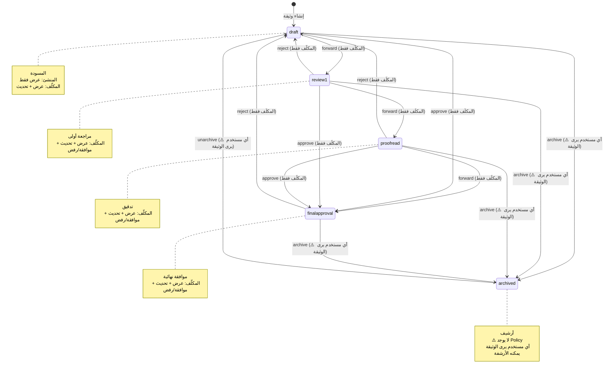
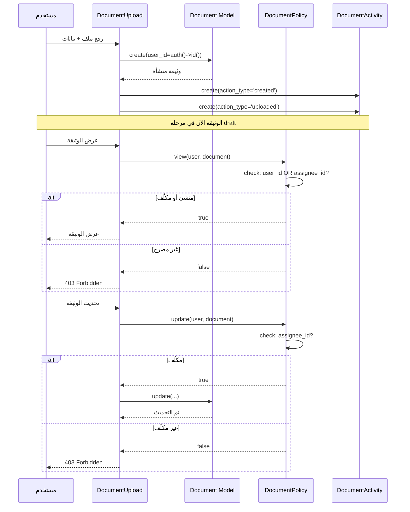
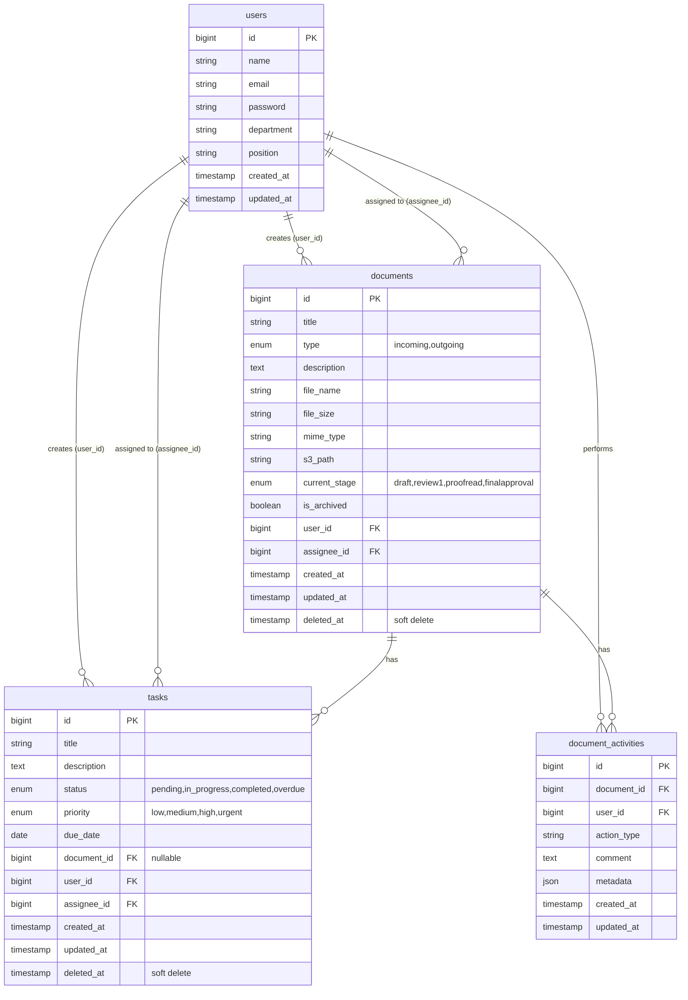
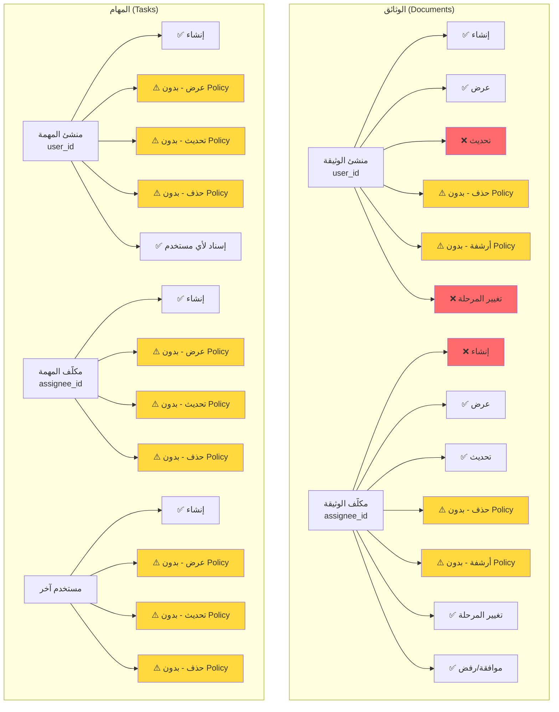
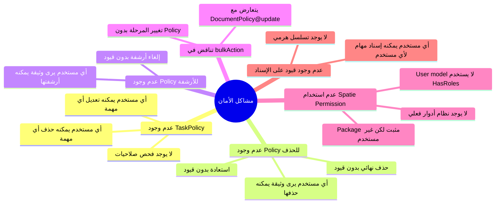

---
**Updated:** 2025-12-22 - Defao v1.0.1  
**Status:** ✅ Production Ready  
**Features:** Workflow, Reports link, Arabic toasts  
---

# مخططات الأدوار والصلاحيات - Mermaid Diagrams

## 1. Class Diagram - هيكل الأدوار والصلاحيات



## 2. Flowchart - سير العمل والصلاحيات

```mermaid
flowchart TD
    Start([مستخدم مسجل<br/>auth()->id()]) --> CreateDoc{إنشاء وثيقة}
    CreateDoc -->|DocumentUpload@save| DocCreated[وثيقة منشأة<br/>user_id = auth()->id()<br/>assignee_id = auth()->id()]
    
    DocCreated --> ViewDoc{عرض وثيقة}
    ViewDoc -->|DocumentPolicy@view| CheckView{منشئ OR مكلّف?}
    CheckView -->|نعم| ShowDoc[✅ عرض الوثيقة]
    CheckView -->|لا| DenyView[❌ رفض الوصول<br/>403]
    
    ShowDoc --> UpdateDoc{تحديث وثيقة}
    UpdateDoc -->|DocumentPolicy@update| CheckAssignee{مكلّف?<br/>assignee_id}
    CheckAssignee -->|نعم| AllowUpdate[✅ السماح بالتحديث]
    CheckAssignee -->|لا| DenyUpdate[❌ رفض التحديث]
    
    AllowUpdate --> Workflow{سير العمل}
    Workflow -->|DocumentDetail@approve| Approve[✅ الموافقة<br/>finalapproval]
    Workflow -->|DocumentDetail@reject| Reject[✅ الرفض<br/>draft]
    Workflow -->|DocumentDetail@forward| Forward[✅ التحويل<br/>next stage]
    
    ShowDoc --> ArchiveDoc{أرشفة}
    ArchiveDoc -->|DocumentTable@archiveDocument| CheckVisible{visibleTo?}
    CheckVisible -->|نعم| ArchiveOK[✅ أرشفة<br/>⚠️ بدون Policy]
    
    ShowDoc --> DeleteDoc{حذف}
    DeleteDoc -->|DocumentTable@bulkAction| CheckVisible2{visibleTo?}
    CheckVisible2 -->|نعم| DeleteOK[✅ حذف<br/>⚠️ بدون Policy]
    
    ShowDoc --> BulkStage{تغيير المرحلة<br/>bulkAction}
    BulkStage -->|DocumentTable@bulkAction| CheckVisible3{visibleTo?}
    CheckVisible3 -->|نعم| BulkStageOK[✅ تغيير المرحلة<br/>⚠️ تناقض مع Policy!]
    
    Start --> CreateTask{إنشاء مهمة}
    CreateTask -->|TaskForm@save| TaskCreated[مهمة منشأة<br/>user_id = auth()->id()<br/>assignee_id = أي مستخدم]
    
    TaskCreated --> UpdateTask{تحديث/حذف مهمة}
    UpdateTask -->|TaskForm@save<br/>TaskList@deleteTask| NoPolicy[⚠️ لا يوجد Policy!]
    NoPolicy --> AllowAny[✅ أي مستخدم يمكنه<br/>تعديل/حذف أي مهمة]
    
    style DenyView fill:#ff6b6b,stroke:#c92a2a,stroke-width:2px
    style DenyUpdate fill:#ff6b6b,stroke:#c92a2a,stroke-width:2px
    style ArchiveOK fill:#ffd93d,stroke:#f59f00,stroke-width:2px
    style DeleteOK fill:#ffd93d,stroke:#f59f00,stroke-width:2px
    style BulkStageOK fill:#ff6b6b,stroke:#c92a2a,stroke-width:2px
    style AllowAny fill:#ff6b6b,stroke:#c92a2a,stroke-width:2px
    style NoPolicy fill:#ff6b6b,stroke:#c92a2a,stroke-width:2px
```

## 3. State Diagram - مراحل سير العمل



## 4. Sequence Diagram - عملية إنشاء وتحديث وثيقة



## 5. ER Diagram - العلاقات بين الجداول



## 6. Permission Matrix - مصفوفة الصلاحيات



## 7. Security Issues Diagram - مشاكل الأمان



---

**ملاحظة:** جميع المخططات مبنية على تحليل الكود الفعلي في المشروع.

