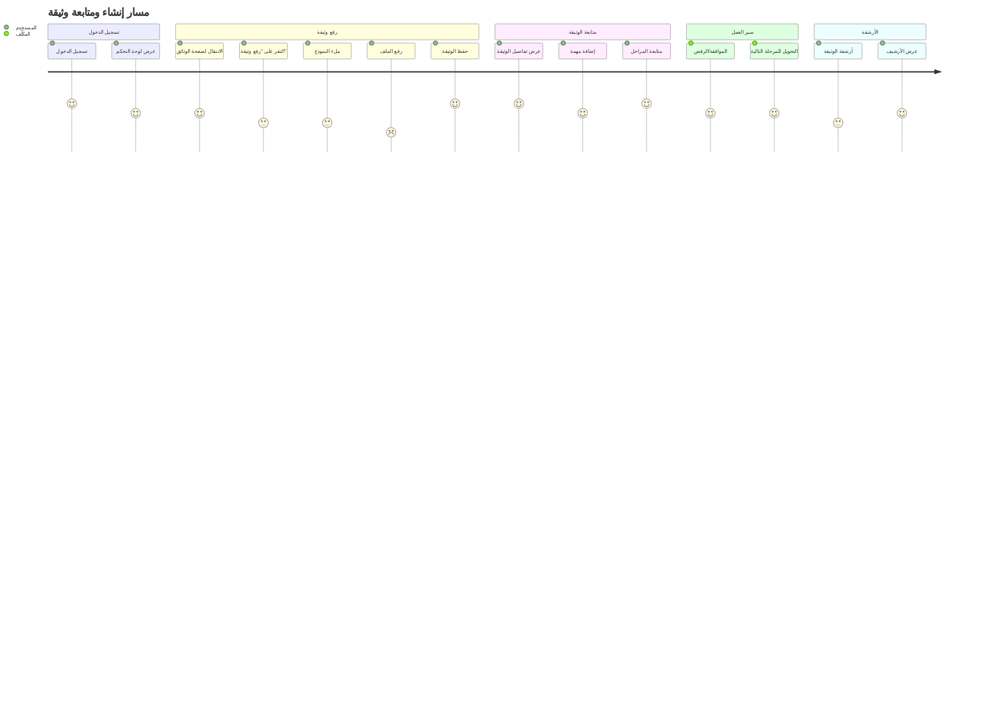
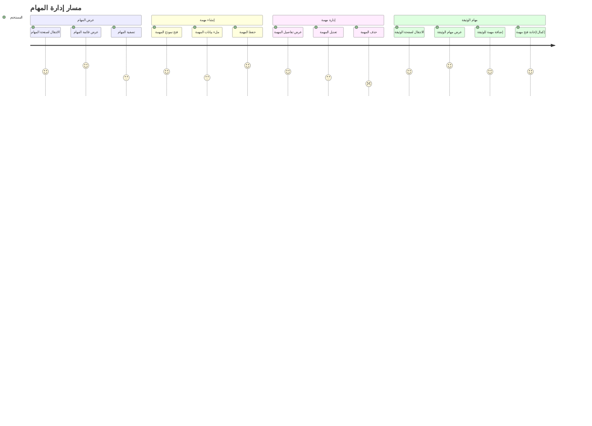
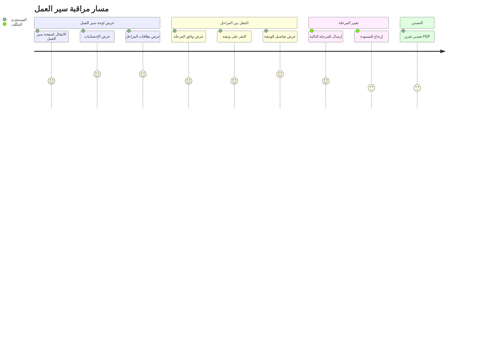
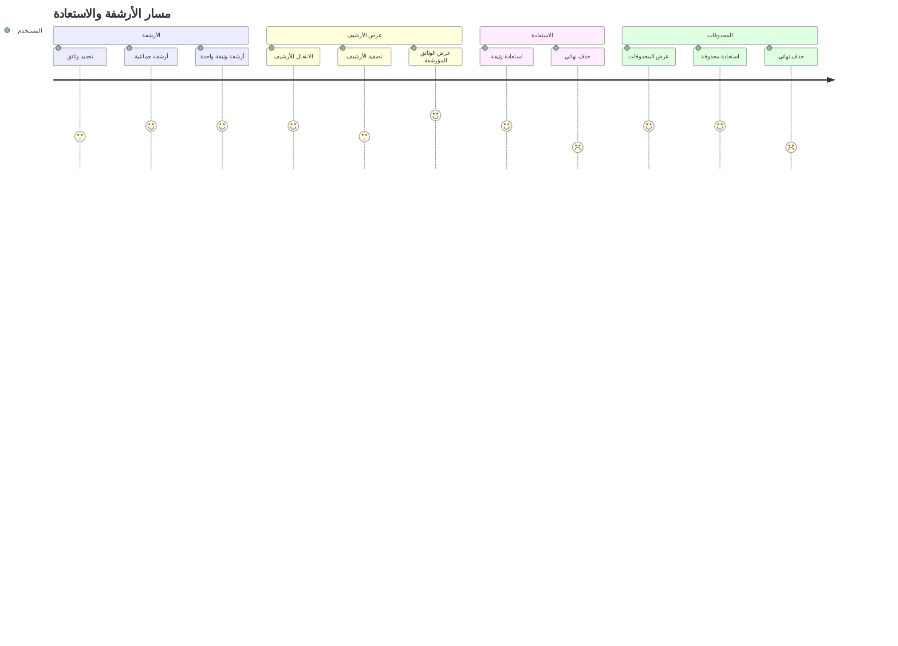
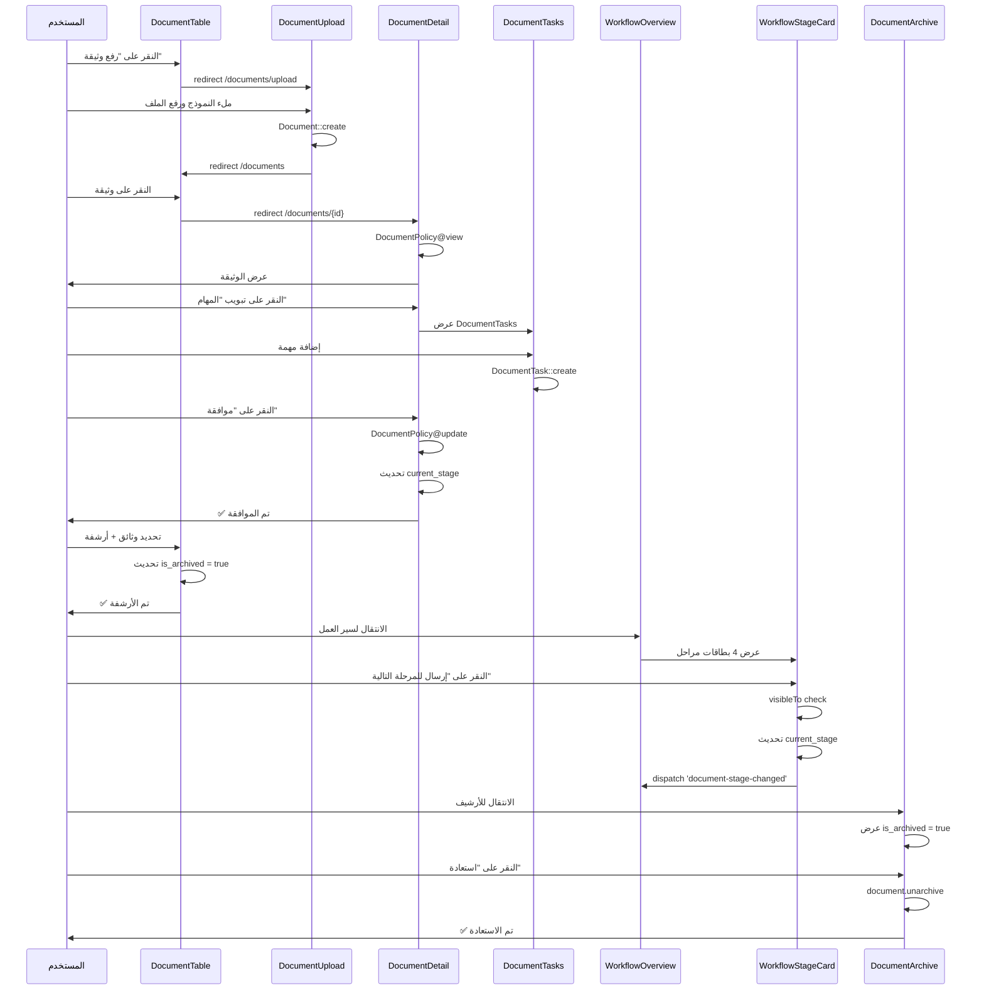
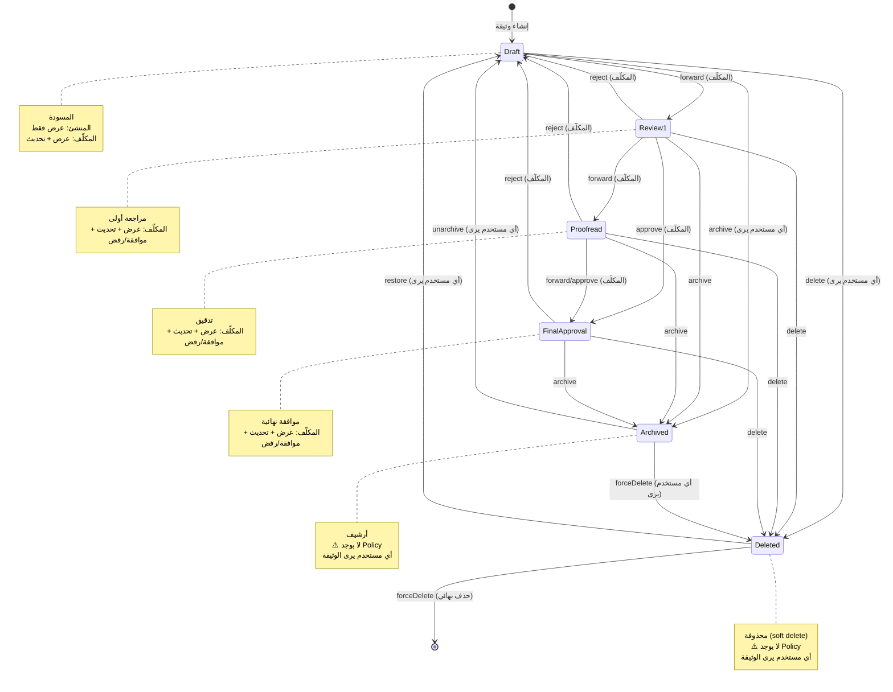
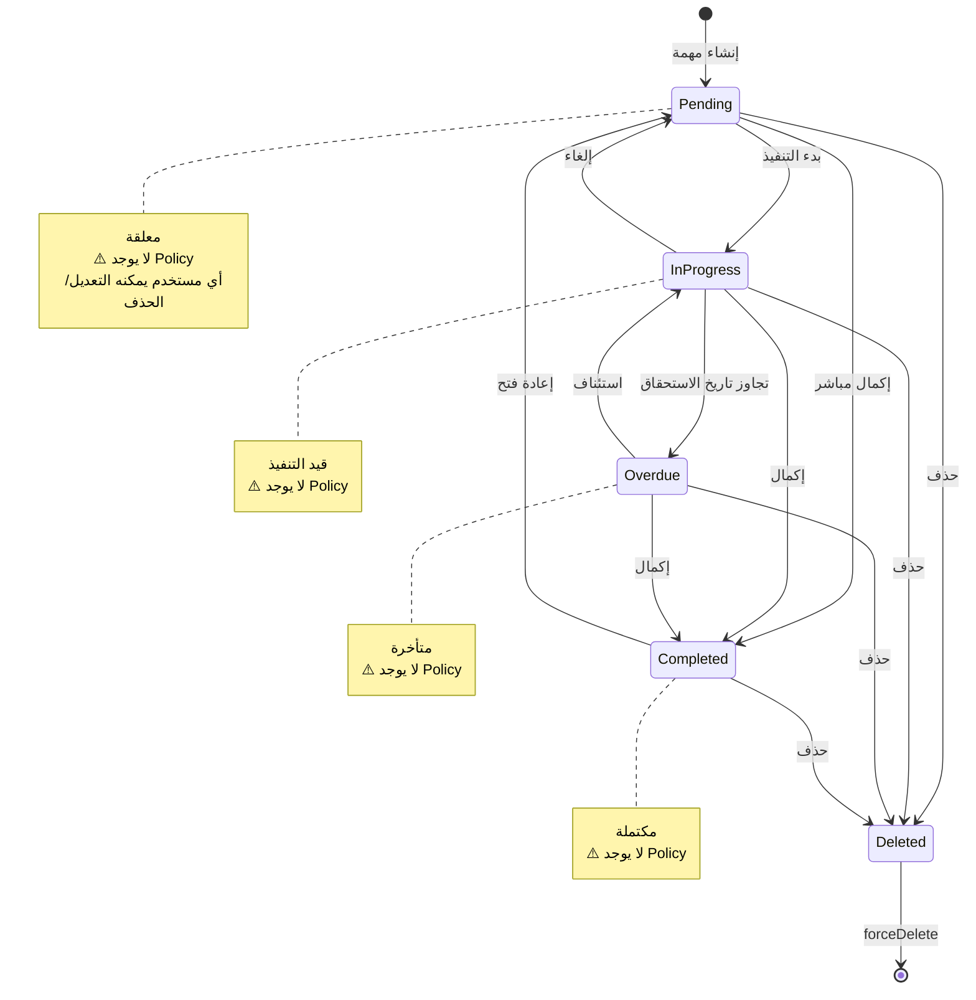
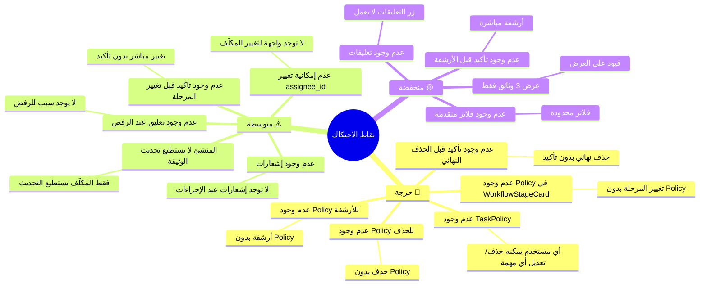
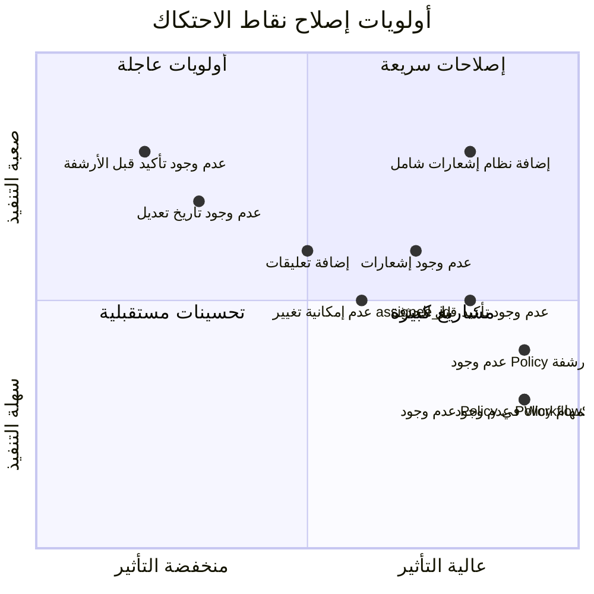

---
**Updated:** 2025-12-22 - Defao v1.0.1  
**Status:** ✅ Production Ready  
**Features:** Workflow, Reports link, Arabic toasts  
---

# مخططات مسارات المستخدمين - Mermaid Diagrams

## 1. مسار إنشاء ومتابعة وثيقة - مخطط شامل



## 2. مسار إدارة المهام - مخطط شامل



## 3. مسار مراقبة سير العمل - مخطط شامل



## 4. مسار الأرشفة والاستعادة - مخطط شامل



## 5. مخطط تدفق شامل - جميع المسارات

```mermaid
flowchart TB
    subgraph "نقاط الدخول"
        Login[تسجيل الدخول<br/>/login]
        Dashboard[لوحة التحكم<br/>/dashboard]
    end
    
    subgraph "مسار الوثائق"
        DocsIndex[قائمة الوثائق<br/>/documents]
        Upload[رفع وثيقة<br/>/documents/upload]
        DocDetail[تفاصيل الوثيقة<br/>/documents/{id}]
        Archive[الأرشيف<br/>/documents/archive]
    end
    
    subgraph "مسار المهام"
        TasksIndex[قائمة المهام<br/>/tasks]
        TaskForm[نموذج المهمة<br/>Modal]
        DocTasks[مهام الوثيقة<br/>Tab في DocumentDetail]
    end
    
    subgraph "مسار سير العمل"
        Workflow[لوحة سير العمل<br/>/workflow]
        StageCard[بطاقة المرحلة<br/>WorkflowStageCard]
    end
    
    subgraph "مسار الأرشفة"
        Trash[المحذوفات<br/>/archive]
        Restore[استعادة]
        ForceDelete[حذف نهائي]
    end
    
    Login --> Dashboard
    Dashboard --> DocsIndex
    Dashboard --> TasksIndex
    Dashboard --> Workflow
    
    DocsIndex --> Upload
    DocsIndex --> DocDetail
    DocsIndex --> Archive
    
    Upload --> DocsIndex
    DocDetail --> DocTasks
    DocDetail --> Archive
    
    TasksIndex --> TaskForm
    DocDetail --> DocTasks
    
    Workflow --> StageCard
    StageCard --> DocDetail
    
    Archive --> Restore
    Archive --> ForceDelete
    
    DocsIndex --> Trash
    Trash --> Restore
    Trash --> ForceDelete
    
    style Login fill:#4a90e2
    style Dashboard fill:#4a90e2
    style DocDetail fill:#50c878
    style Workflow fill:#f39c12
    style Archive fill:#e74c3c
    style Trash fill:#e74c3c
```

## 6. مخطط تفاعل المستخدم - User Interaction Flow



## 7. مخطط حالات الوثيقة - Document State Machine



## 8. مخطط حالات المهمة - Task State Machine



## 9. مخطط نقاط الاحتكاك - Friction Points Map



## 10. مخطط أولويات الإصلاح - Priority Matrix



---

**ملاحظة:** جميع المخططات مبنية على تحليل الكود الفعلي في المشروع.

