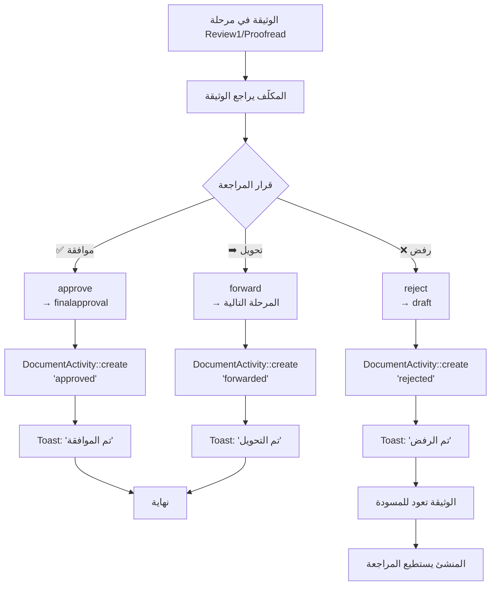

---
**Updated:** 2025-12-22 - Defao v1.0.1  
**Status:** ✅ Production Ready  
**Features:** Workflow, Reports link, Arabic toasts  
---

# مخطط Swimlane Diagram شامل لسير العمل (End-to-End Workflow)

## 📋 الفهرس

1. [الأدوار (Actors/Roles)](#1-الأدوار-actorsroles)
2. [السيناريو الكامل](#2-السيناريو-الكامل)
3. [Swimlane Diagram](#3-swimlane-diagram)
4. [جدول الخطوات التفصيلي](#4-جدول-الخطوات-التفصيلي)
5. [نقاط القرار](#5-نقاط-القرار)
6. [الخدمات المساندة](#6-الخدمات-المساندة)

---

## 1. الأدوار (Actors/Roles)

### الأدوار المستنتجة من الكود:

| الدور | المفتاح | الوصف | الصلاحيات |
|------|---------|-------|-----------|
| **منشئ الوثيقة** | `user_id` | المستخدم الذي أنشأ الوثيقة | ✅ عرض، ❌ تحديث، ⚠️ أرشفة/حذف (بدون Policy) |
| **مكلّف الوثيقة** | `assignee_id` | المستخدم المكلّف بالوثيقة | ✅ عرض، ✅ تحديث، ✅ تغيير المرحلة، ⚠️ أرشفة/حذف (بدون Policy) |
| **مستخدم آخر** | - | أي مستخدم آخر | ❌ عرض، ❌ تحديث، ❌ تغيير المرحلة |

**ملاحظة:** عند الإنشاء، `assignee_id = auth()->id()` (أي المنشئ نفسه).

---

## 2. السيناريو الكامل

### المسار النموذجي:
1. **إنشاء وثيقة** → `draft` (المنشئ)
2. **مراجعة أولى** → `review1` (المكلّف)
3. **تدقيق** → `proofread` (المكلّف)
4. **موافقة نهائية** → `finalapproval` (المكلّف)
5. **أرشفة** → `is_archived = true` (أي مستخدم يرى الوثيقة)

### المسارات البديلة:
- **الرفض:** أي مرحلة → `draft` (المكلّف)
- **الموافقة المباشرة:** `draft` → `finalapproval` (المكلّف)
- **الأرشفة المبكرة:** أي مرحلة → `Archived` (أي مستخدم يرى الوثيقة)
- **الحذف:** أي مرحلة → `Deleted` (أي مستخدم يرى الوثيقة)

---

## 3. Swimlane Diagram

```mermaid
flowchart TB
    subgraph Creator["👤 منشئ الوثيقة (Creator)<br/>user_id"]
        C1[1. إنشاء وثيقة جديدة<br/>DocumentUpload::save]
        C2[2. رفع الملف<br/>store to local]
        C3[3. Document::create<br/>current_stage = 'draft'<br/>assignee_id = auth()->id()]
        C4[4. DocumentActivity::create<br/>'created' + 'uploaded']
        C5[5. redirect → /documents]
        C6[6. عرض الوثيقة<br/>DocumentDetail]
        C7[7. إضافة مهام فرعية<br/>DocumentTasks::addTask]
        C8[8. متابعة التقدم<br/>عرض activityLog]
        C9[9. أرشفة الوثيقة<br/>DocumentTable::archiveDocument<br/>⚠️ بدون Policy]
    end
    
    subgraph Assignee["👤 مكلّف الوثيقة (Assignee)<br/>assignee_id"]
        A1[1. استقبال إشعار<br/>⚠️ غير موجود حالياً]
        A2[2. عرض الوثيقة<br/>DocumentDetail]
        A3[3. مراجعة الوثيقة]
        A4{4. قرار المراجعة}
        A5[5a. الموافقة المباشرة<br/>approve → finalapproval<br/>✅ DocumentPolicy@update]
        A6[5b. التحويل للمرحلة التالية<br/>forward → next stage<br/>✅ DocumentPolicy@update]
        A7[5c. الرفض<br/>reject → draft<br/>✅ DocumentPolicy@update]
        A8[6. DocumentActivity::create<br/>'approved' / 'forwarded' / 'rejected']
        A9[7. إضافة مهام فرعية<br/>DocumentTasks::addTask]
        A10[8. إكمال مهام<br/>DocumentTasks::markDone]
        A11[9. أرشفة الوثيقة<br/>DocumentTable::archiveDocument<br/>⚠️ بدون Policy]
    end
    
    subgraph System["⚙️ النظام (System)"]
        S1[1. التحقق من الصلاحيات<br/>DocumentPolicy@view]
        S2[2. التحقق من الصلاحيات<br/>DocumentPolicy@update]
        S3[3. تحديث current_stage]
        S4[4. تسجيل DocumentActivity]
        S5[5. عرض Toast Notification]
        S6[6. تحديث WorkflowOverview<br/>dispatch 'document-stage-changed']
        S7[7. فحص Overdue Documents<br/>DocumentTable::overdue]
        S8[8. Bulk Actions<br/>DocumentTable::bulkAction<br/>⚠️ بدون Policy]
    end
    
    subgraph Workflow["📋 لوحة سير العمل<br/>WorkflowOverview"]
        W1[1. عرض الإحصائيات<br/>totalDocuments, overdueDocuments]
        W2[2. عرض بطاقات المراحل<br/>WorkflowStageCard × 4]
        W3[3. عرض 3 وثائق حديثة<br/>recentDocuments per stage]
        W4[4. تغيير المرحلة<br/>advanceStage / rejectStage<br/>⚠️ visibleTo فقط]
    end
    
    subgraph Tasks["✅ المهام الفرعية<br/>DocumentTasks"]
        T1[1. إضافة مهمة<br/>addTask]
        T2[2. إسناد مهمة<br/>assigned_to]
        T3[3. إكمال مهمة<br/>markDone]
        T4[4. إعادة فتح مهمة<br/>reopen]
        T5[5. حذف مهمة<br/>deleteTask<br/>⚠️ بدون Policy]
    end
    
    subgraph Archive["📦 الأرشيف<br/>DocumentArchive"]
        AR1[1. عرض الوثائق المؤرشفة<br/>is_archived = true]
        AR2[2. إلغاء الأرشفة<br/>unarchive<br/>⚠️ بدون Policy]
        AR3[3. حذف نهائي<br/>forceDelete<br/>⚠️ بدون Policy]
    end
    
    %% Connections
    C1 --> C2
    C2 --> C3
    C3 --> C4
    C4 --> C5
    C5 --> C6
    C6 --> S1
    S1 -->|✅ منشئ أو مكلّف| C7
    C7 --> T1
    C6 --> C8
    C8 --> C9
    C9 --> S8
    
    A1 -.->|⚠️ غير موجود| A2
    A2 --> S1
    S1 -->|✅ منشئ أو مكلّف| A3
    A3 --> A4
    A4 -->|موافقة| A5
    A4 -->|تحويل| A6
    A4 -->|رفض| A7
    A5 --> S2
    A6 --> S2
    A7 --> S2
    S2 -->|✅ المكلّف فقط| S3
    S3 --> A8
    A8 --> S4
    S4 --> S5
    S5 --> S6
    S6 --> W1
    A2 --> A9
    A9 --> T1
    A2 --> A10
    A10 --> T3
    A2 --> A11
    A11 --> S8
    
    W1 --> W2
    W2 --> W3
    W3 --> W4
    W4 -->|⚠️ visibleTo فقط| S3
    
    T1 --> T2
    T2 --> T3
    T3 --> T4
    T4 --> T5
    
    C9 --> AR1
    AR1 --> AR2
    AR1 --> AR3
    
    %% Overdue detection
    S7 -->|review1 > 7 days<br/>proofread > 5 days<br/>finalapproval > 3 days| S5
    
    style C1 fill:#e3f2fd
    style A4 fill:#fff9c4
    style S2 fill:#c8e6c9
    style S8 fill:#ffcdd2
    style W4 fill:#ffcdd2
    style T5 fill:#ffcdd2
    style AR2 fill:#ffcdd2
    style AR3 fill:#ffcdd2
```

---

## 4. جدول الخطوات التفصيلي

| # | الخطوة | الدور | الإجراء | المكون | الشرط | الخطوة التالية | ⚠️ المشكلة |
|---|--------|------|---------|--------|-------|----------------|-----------|
| **1** | إنشاء وثيقة | منشئ | `DocumentUpload::save` | `DocumentUpload` | `auth()->id()` | الخطوة 2 | - |
| **2** | رفع الملف | منشئ | `store('documents', 'local')` | `DocumentUpload` | - | الخطوة 3 | - |
| **3** | حفظ الوثيقة | نظام | `Document::create` | `DocumentUpload` | - | الخطوة 4 | - |
| **4** | تسجيل الأنشطة | نظام | `DocumentActivity::create` | `DocumentUpload` | - | الخطوة 5 | - |
| **5** | إعادة التوجيه | نظام | `redirect('/documents')` | `DocumentUpload` | - | الخطوة 6 | - |
| **6** | عرض الوثيقة | منشئ/مكلّف | `DocumentDetail::mount` | `DocumentDetail` | ✅ `DocumentPolicy@view` | الخطوة 7 | - |
| **7** | إضافة مهام | منشئ/مكلّف | `DocumentTasks::addTask` | `DocumentTasks` | ✅ `visibleTo` | الخطوة 8 | - |
| **8** | مراجعة الوثيقة | مكلّف | عرض `DocumentDetail` | `DocumentDetail` | ✅ `DocumentPolicy@view` | الخطوة 9 | - |
| **9** | قرار المراجعة | مكلّف | `approve()` / `forward()` / `reject()` | `DocumentDetail` | ✅ `DocumentPolicy@update` | الخطوة 10 | - |
| **10** | التحقق من الصلاحيات | نظام | `DocumentPolicy@update` | `DocumentDetail` | ✅ المكلّف فقط | الخطوة 11 | - |
| **11** | تحديث المرحلة | نظام | `update(['current_stage'])` | `DocumentDetail` | - | الخطوة 12 | - |
| **12** | تسجيل النشاط | نظام | `DocumentActivity::create` | `DocumentDetail` | - | الخطوة 13 | - |
| **13** | إشعار المستخدم | نظام | `dispatch('show-toast')` | `DocumentDetail` | - | الخطوة 14 | ⚠️ لا إشعارات |
| **14** | تحديث لوحة سير العمل | نظام | `dispatch('document-stage-changed')` | `WorkflowStageCard` | - | الخطوة 15 | - |
| **15** | عرض لوحة سير العمل | أي مستخدم | `WorkflowOverview` | `WorkflowOverview` | ✅ `visibleTo` | الخطوة 16 | - |
| **16** | تغيير المرحلة من اللوحة | أي مستخدم | `advanceStage()` / `rejectStage()` | `WorkflowStageCard` | ⚠️ `visibleTo` فقط | الخطوة 11 | ❌ لا Policy |
| **17** | إجراءات جماعية | أي مستخدم | `bulkAction()` | `DocumentTable` | ⚠️ `visibleTo` فقط | الخطوة 11 | ❌ لا Policy |
| **18** | أرشفة الوثيقة | أي مستخدم | `archiveDocument()` | `DocumentTable` | ⚠️ `visibleTo` فقط | الخطوة 19 | ❌ لا Policy |
| **19** | عرض الأرشيف | أي مستخدم | `DocumentArchive` | `DocumentArchive` | ✅ `visibleTo` | الخطوة 20 | - |
| **20** | إلغاء الأرشفة | أي مستخدم | `unarchive()` | `DocumentArchive` | ⚠️ `visibleTo` فقط | الخطوة 6 | ❌ لا Policy |
| **21** | حذف نهائي | أي مستخدم | `forceDelete()` | `DocumentArchive` | ⚠️ `visibleTo` فقط | نهاية | ❌ لا Policy |

---

## 5. نقاط القرار

### 5.1 قرار المراجعة (Review Decision)



### 5.2 اكتشاف خطأ في مرحلة متقدمة

**السيناريو:** وثيقة في مرحلة `proofread` أو `finalapproval` وتم اكتشاف خطأ.

| الحل الحالي | الوصف | المشكلة |
|-------------|-------|---------|
| **reject()** | المكلّف يستطيع رفض الوثيقة وإرجاعها لـ `draft` | ✅ يعمل |
| **bulkAction('stage_draft')** | أي مستخدم يرى الوثيقة يستطيع إرجاعها لـ `draft` | ❌ بدون Policy |

**التوصية:** استخدام `reject()` فقط (محمي بـ Policy).

### 5.3 إدارة المستندات المتأخرة (Overdue Documents)

**الكود الموجود:** `DocumentTable::overdue`

```php
->when($this->overdue, function ($q) {
    $q->where(function ($sub) {
        $sub->where('current_stage', 'review1')
            ->where('updated_at', '<', now()->subDays(7));
        $sub->orWhere('current_stage', 'proofread')
            ->where('updated_at', '<', now()->subDays(5));
        $sub->orWhere('current_stage', 'finalapproval')
            ->where('updated_at', '<', now()->subDays(3));
    });
})
```

**القواعد:**
- `review1` > 7 أيام = متأخرة
- `proofread` > 5 أيام = متأخرة
- `finalapproval` > 3 أيام = متأخرة

**المشكلة:** ⚠️ لا توجد إشعارات تلقائية للمكلّف عند التأخير.

---

## 6. الخدمات المساندة

### 6.1 DocumentTasks (المهام الفرعية)

| الإجراء | الدور | الشرط | المشكلة |
|---------|------|-------|---------|
| `addTask` | منشئ/مكلّف | ✅ `visibleTo` | - |
| `markDone` | منشئ/مكلّف | ✅ `visibleTo` | - |
| `reopen` | منشئ/مكلّف | ✅ `visibleTo` | - |
| `deleteTask` | منشئ/مكلّف | ✅ `visibleTo` | ❌ لا Policy |

**التفاعل مع سير العمل:**
- المهام الفرعية **مستقلة** عن مراحل الوثيقة
- يمكن إضافة مهام في أي مرحلة
- لا تؤثر المهام على انتقال المراحل

### 6.2 Bulk Actions

| الإجراء | الدور | الشرط | المشكلة |
|---------|------|-------|---------|
| `bulkAction('archive')` | أي مستخدم يرى الوثيقة | ⚠️ `visibleTo` | ❌ لا Policy |
| `bulkAction('delete')` | أي مستخدم يرى الوثيقة | ⚠️ `visibleTo` | ❌ لا Policy |
| `bulkAction('stage_*')` | أي مستخدم يرى الوثيقة | ⚠️ `visibleTo` | ❌ لا Policy |

**التفاعل مع سير العمل:**
- يمكن تغيير مرحلة **عدة وثائق** دفعة واحدة
- ⚠️ **خطر:** يمكن لأي مستخدم تغيير مرحلة وثائق ليست مكلّفة له

### 6.3 Export/Print

| الإجراء | الدور | الشرط | الحالة |
|---------|------|-------|--------|
| `exportPdf` | منشئ/مكلّف | ✅ `visibleTo` | ✅ يعمل |
| `download` | منشئ/مكلّف | ✅ `DocumentPolicy@view` | ⚠️ TODO (Phase 6) |

**التفاعل مع سير العمل:**
- يمكن تصدير الوثائق في **أي مرحلة**
- لا يؤثر التصدير على سير العمل

### 6.4 Notifications

**الحالة الحالية:** ❌ **غير موجود**

**المطلوب:**
- إشعار عند إسناد وثيقة
- إشعار عند تغيير المرحلة
- إشعار عند التأخير (Overdue)
- إشعار عند الرفض

---

## 7. ملخص التفاعلات بين الأدوار

### 7.1 من يسند المهام لمن؟

| المهمة | من | إلى | الشرط |
|--------|----|-----|-------|
| **إسناد وثيقة** | ⚠️ غير موجود | - | لا توجد واجهة لتغيير `assignee_id` |
| **إسناد مهمة فرعية** | منشئ/مكلّف | أي مستخدم | ✅ `visibleTo` |

### 7.2 من يوافق على الانتقال للمرحلة التالية؟

| الانتقال | من | الشرط |
|----------|----|-------|
| **forward()** | مكلّف | ✅ `DocumentPolicy@update` |
| **approve()** | مكلّف | ✅ `DocumentPolicy@update` |
| **reject()** | مكلّف | ✅ `DocumentPolicy@update` |
| **advanceStage()** | ⚠️ أي مستخدم يرى الوثيقة | ❌ `visibleTo` فقط |
| **bulkAction('stage_*')** | ⚠️ أي مستخدم يرى الوثيقة | ❌ `visibleTo` فقط |

### 7.3 من يمكنه الأرشفة؟

| الإجراء | من | الشرط |
|---------|----|-------|
| **archiveDocument()** | ⚠️ أي مستخدم يرى الوثيقة | ❌ `visibleTo` فقط |
| **bulkAction('archive')** | ⚠️ أي مستخدم يرى الوثيقة | ❌ `visibleTo` فقط |

---

## 8. التوصيات

### 8.1 أولويات عاجلة

1. ✅ **إضافة واجهة لتغيير `assignee_id`**
   - Dropdown في `DocumentDetail` أو `DocumentUpload`
   - Policy: المنشئ فقط يستطيع تغيير المكلّف

2. ✅ **إصلاح `WorkflowStageCard`**
   - استخدام `DocumentPolicy@update` بدلاً من `visibleTo`

3. ✅ **إصلاح `bulkAction`**
   - استخدام `DocumentPolicy@update` لتغيير المرحلة
   - استخدام `DocumentPolicy@archive` للأرشفة
   - استخدام `DocumentPolicy@delete` للحذف

4. ✅ **إضافة نظام إشعارات**
   - إشعار عند إسناد وثيقة
   - إشعار عند تغيير المرحلة
   - إشعار عند التأخير

### 8.2 تحسينات

1. ✅ **إضافة DocumentActivity للأرشفة والحذف**
2. ✅ **إضافة تأكيد قبل الحذف النهائي**
3. ✅ **إضافة تعليقات عند الرفض**

---

**تاريخ الإنشاء:** 2025-01-27  
**آخر تحديث:** 2025-01-27  
**الإصدار:** 1.0

